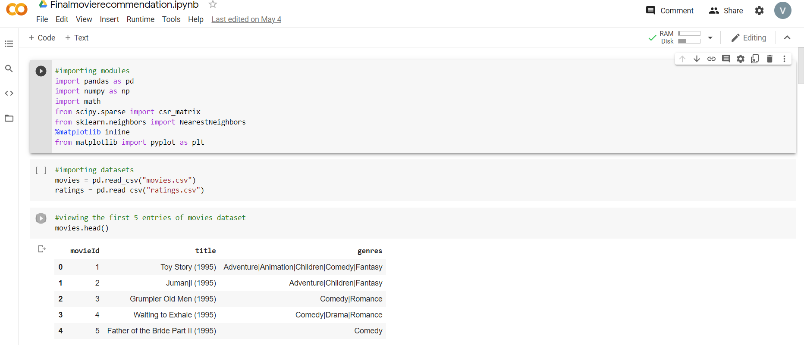
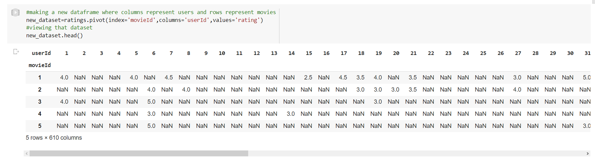
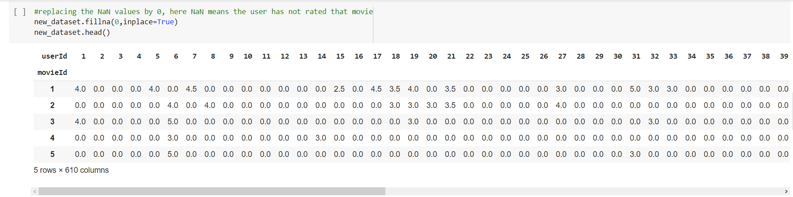
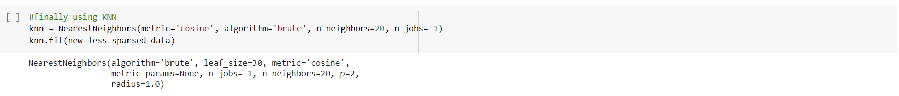
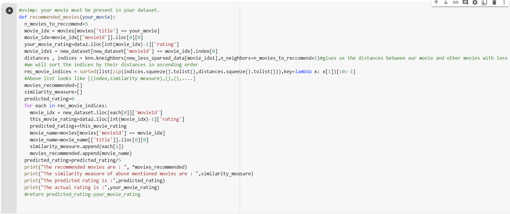
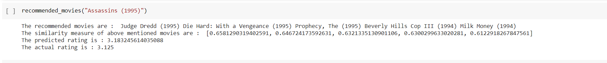
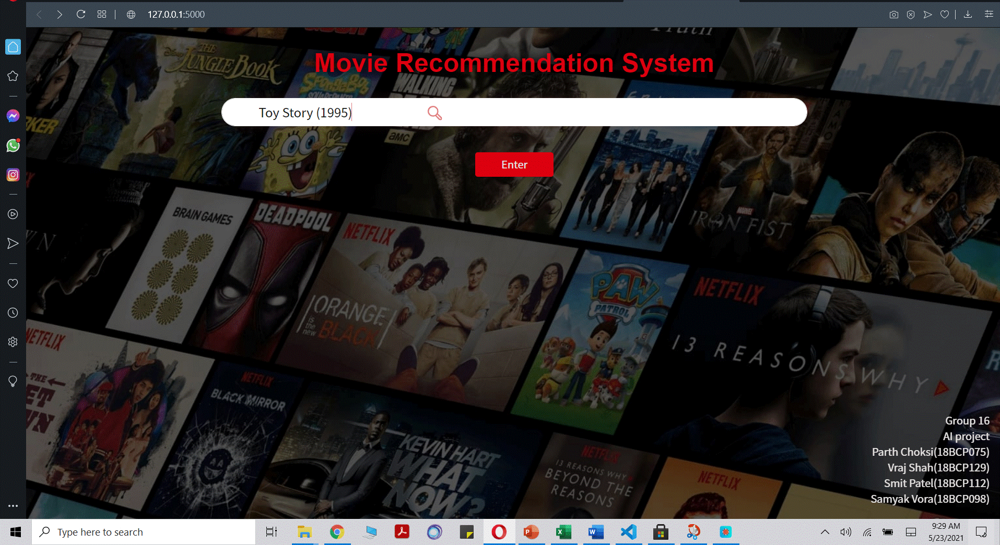
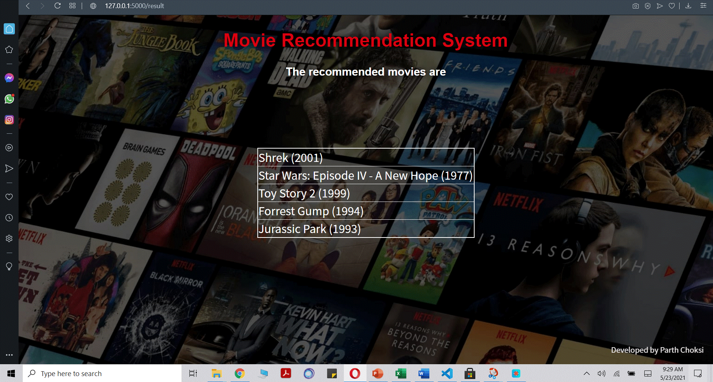
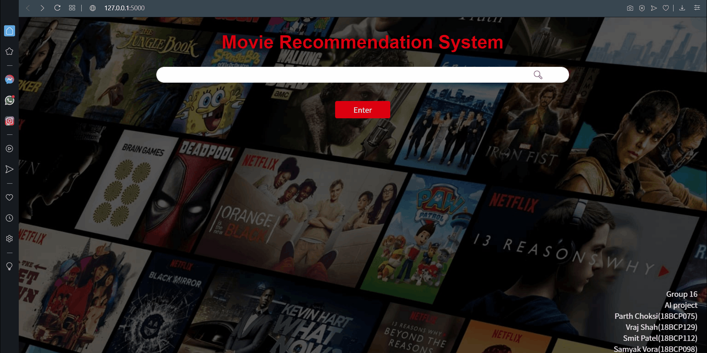

# AI_MOVIE_RECOMMENDATION 
This is a project in which we can recommend user movie of his/her preferences. 
   
<h1>Problem Statement</h1> 
– Recommendation systems imitate this social  process to enable quick filtering of the information on the web 
The major Problem which we currently have are as follows: 
– Recommendations are not personalized as per user attributes and all users see the same recommendations irrespective of their preferences 
– Another problem is that the number of reviews (which reflects the number of people who have viewed the movie) will vary for each movie and hence the average star rating will have discrepancies.  
– The system doesn’t take into account the regional and language preferences and might recommend movies in languages that a regional dialect speaking individual might not understand 
 
<h1>Dataset:</h1> 
•	We have used Movie Lens Dataset by Group Lens 
•	This data set consists of: 
•	100,000 ratings (1-5) from 610 users on 193609  movies. 
•	Users of Movie Lens were selected randomly. 
•	All users rated at least 20 movies. 
•	Each user represented by a unique id. 

<h1>How to Run?</h1> 
<b>1)Running CollaborativeFiltering.ipynb:</b>  
    a)Download the "CollaborativeFiltering.ipynb" and "datasets" on your desktop 
    b)You can open this file on Google-colab/jupyter notebook etc. 
    c)In Google Colab add the two files:"movies.csv" and "ratings.csv"  from datasets folder in the run-time. 
And you are good to go,you can add your own movie in the last cell and get recommended movies.  

<b>2)Running Contentbasedfiltering.ipynb:</b>  
    Here we tried another approach of recommendations system called content based filtering where movies are recommended based on their  genres. This is less efficient approach and has some disadvantages over collaborativefiltering approach. 
     a)Download the "ContentbasedFiltering.ipynb" and "datasets" on your desktop 
     b)You can open this file on Google-colab/jupyter notebook etc. 
     c)In Google Colab add the two files:"movies.csv" and "ratings.csv"  from datasets folder in the run-time. 
And you are good to go.Here you need to enter input in different format mentioned in that cell itself.  

<b>3)Website:</b>  
    Finally we integrated CollaborativeFiltering and made a website using flask where you can enter the movie and get some recommendations. 
    Requirements:Python,Flask etc.. 
    a)Download the "WEB-APPLICATION" folder on your desktop 
    b)Navigate to the folder and run the following command: 
        $ python main.py 
Just this and you are good to go 
Note:If you get some error regarding module not found, please download those modules using "pip install module name" 
 
<h1>Code</h1>
<b>Google Colab</b> 
#importing modules 
#importing datasets 
 
#making a new dataframe where columns represent users and rows represent movies 
 
 
#replacing the NaN values by 0, here NaN means the user has not rated that movie 

 
#finally using KNN 
 
 
#function to recommend movie 
#vvimp: your movie must be present in your dataset. 
 
 
<b>Output:</b> 
 

 
<h1>Website</h1> 

We also made Interface in the form of the website for the detector. The Backend is made using Flask, whereas the frontend is normal HTML and CSS and integrated python code from Google Colab  
  
Movie Recommendation System   
  
 

Short Demo (Please Give it sometime to Load 😃)  
 
 
<h1>References</h1> 
Dataset and Features: 
•	https://files.grouplens.org/datasets/movielens/ml-latest-small.zip 

<b>Research Papers:</b> 
•	For  Movie Recommendation System: 
•	https://www.itm-conferences.org/articles/itmconf/pdf/2017/04/itmconf_ita2017_04008.pdf 
•	https://research.netflix.com/research-area/recommendations 
<b>Future Scope</b> 
•	Integration of this service in a form of plugin in Mobile apps to Reduce user time to search movie of his/her preferences. 
•	Implementing more Functionality Like Hybrid MRS in order to Pull over more Justified Recommendation for User and will also working to get over better accuracy. 

